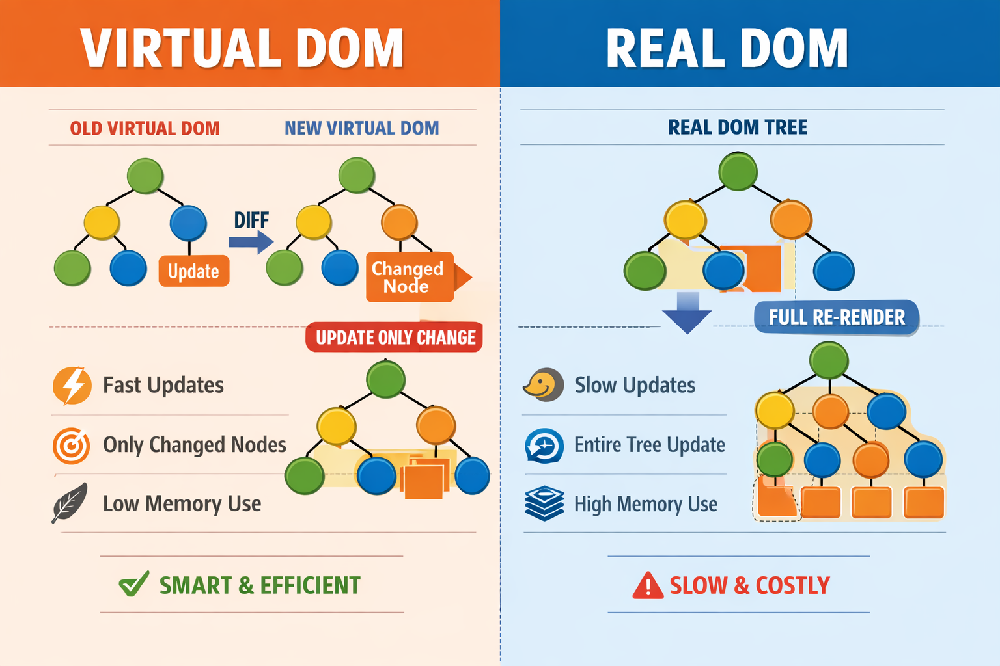

<!---------------------- Real DOM vs Vertual DOM --------------------------->

🌳 Real DOM:
        Actual DOM in the browser
        Updates the entire DOM when something changes
        Slow performance

⚡ Virtual DOM:
        A copy of Real DOM (in memory)
        Compares old vs new (diffing)
        Updates only changed parts
        Faster performance

🔥 Key Difference:
        👉 Real DOM = full update (slow)
        👉 Virtual DOM = partial update (fast)

🧠 One-line (interview):
            Virtual DOM improves performance by updating only the changed elements 
            instead of the whole DOM.

  

